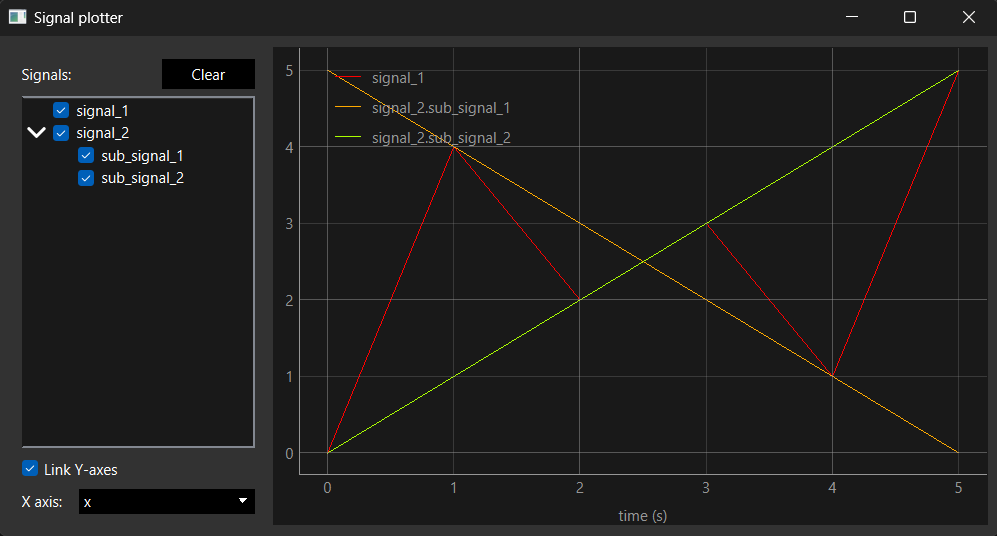

# Simple signal plotter

This is a simple signal plotter that uses `pyqtgraph` to plot signals. It is a simple tool that can be used to plot data and timeseries in a quick and relatively easy way.



## Installation

To install the package, you can use pip:

From a local copy of the repository:

```bash
pip install -e .
```

From the repository:

```bash
pip install git+https://github.com/PYBrulin/signal_plotter.git
```

## Usage

It is also possible to specify the units of the signals. This can be done by adding a `units` key to the nested dictionary. For example:
The package only requires a basic formatting of the data to be plotted. The data should be formatted as a dictionary with required keys: `x` and `y`. Each signal should then be nested in another dictionary, with the key being the name of the signal and the value being the dictionary containing the `x` and `y` data.

If signal keys contain dots, the signal will be slitted and plotted as a sub-plot. So it is possible to group signals by using dots in the signal names.

For example the following data represents three signals, `signal_1` and `signal_2`.

```python
data = {
    'signal_1': {
        'x': [0, 1, 2, 3, 4, 5],
        'y': [0, 4, 2, 3, 1, 5],
        'units': 'V'
    },
    'signal_2.sub_signal_1': {
        'x': [0, 1, 2, 3, 4, 5],
        'y': [5, 4, 3, 2, 1, 0],
        'units': 'A'
    },
    'signal_2.sub_signal_2': {
        'x': [0, 1, 2, 3, 4, 5],
        'y': [0, 1, 2, 3, 4, 5],
        'units': 'A'
    }
}
```

The data can then be plotted using the following code:

```python
from signal_plotter.plot_window import plot_signals
data = { ... }
plot_signals(data)
```

## CSV Parser

The script `csv_parser.py` is a simple script that can be used to parse a CSV file and plot the data. The script can be used directly from the command line if the package is installed:

```bash
python -m signal_plotter.csv_parser path/to/file.csv
```

Documentation for the script can be found using the `-h` flag:

```bash
csv_parser.py [-h] [-x X] [-y Y [Y ...]] csv_file

Read the content of a csv file with pandas and plot the results

positional arguments:
  csv_file              The csv file to read

options:
  -h, --help            show this help message and exit
  -x X, --x X           The x axis column
  -y Y [Y ...], --y Y [Y ...]
                        The y axis columns
```
